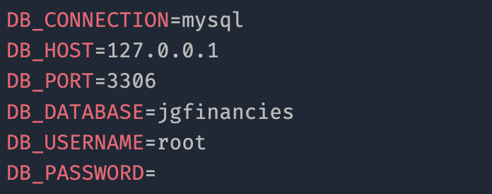

## JG Financies
jgfinances es un emocionante proyecto desarrollado en el marco del programa de certificación en programación de software. Diseñado y construido utilizando el framework Laravel, jgfinances tiene como objetivo proporcionar una solución efectiva y eficiente para la gestión financiera personal. Este software intuitivo y de fácil uso está diseñado para ayudar a los usuarios a llevar un registro preciso de sus entradas y gastos de dinero, brindando una visión completa de sus finanzas.

jgfinances demuestra la capacidad que tenemos para crear soluciones prácticas y funcionales que benefician a los usuarios en su búsqueda de una administración financiera efectiva. Con su enfoque en la usabilidad, la seguridad y la claridad de los datos financieros, este proyecto es un testimonio del compromiso con la excelencia en la programación de software.

En resumen, jgfinances es un proyecto integral de gestión financiera construido con Laravel, diseñado para empoderar a los usuarios en su búsqueda de control financiero y para destacar las habilidades técnicas de nosotros como desarrolladores en el camino hacia la certificación en programación de software.

## Documentacion:

### 1. Clonar el repositorio:
Abre tu terminal y navega al directorio donde deseas clonar el repositorio. Luego, ejecuta el siguiente comando para clonar el repositorio desde GitHub.
*Nota: para este paso, ya debes tener configurado git,credenciales de github y clave ssh*

```git clone git@github.com:daniel-villada/jgfinances.git```

### 2. Navega al directorio del proyecto:
Cambia al directorio del proyecto recien clonado

```cd jgfinances```
### 3. Instalar Dependencias:
Una vez en el directorio del proyecto, utiliza Composer (asegúrate de tenerlo instalado) para instalar las dependencias de Laravel:

```composer install```

una vez terminado de instalar las depencias de composer, corre el siguiente comando para instalar las depencias de yarn(asegúrate de tenerlo instalado) para este paso:

```yarn install```

### 4. Copiar el Archivo de Configuración:

Laravel utiliza un archivo .env para la configuración. Copia el archivo .env.example y renómbralo a .env:

```cp .env.example .env```

### 5. Configurar la Base de Datos:
Edita el archivo .env para configurar los detalles de tu base de datos, como nombre de base de datos, usuario y contraseña. en este paso ya debes tener configurada tu base de datos en SQL. si no la tienes, deberas crear la base de datos para poder realizar este paso.

deberia quedar de la siguiente manera: 

si tu servidor de base de datos tiene contrasena, deberar proporcionarla en este archivo.

### 6. Ejecutar las Migraciones:
Las migraciones se utilizan para crear tablas en la base de datos. Ejecuta el siguiente comando para ejecutar las migraciones:

```php artisan migrate```

### 7. Iniciar el Servidor de Desarrollo:
Puedes iniciar un servidor de desarrollo local ejecutando el siguiente comando:

```php artisan serve```
